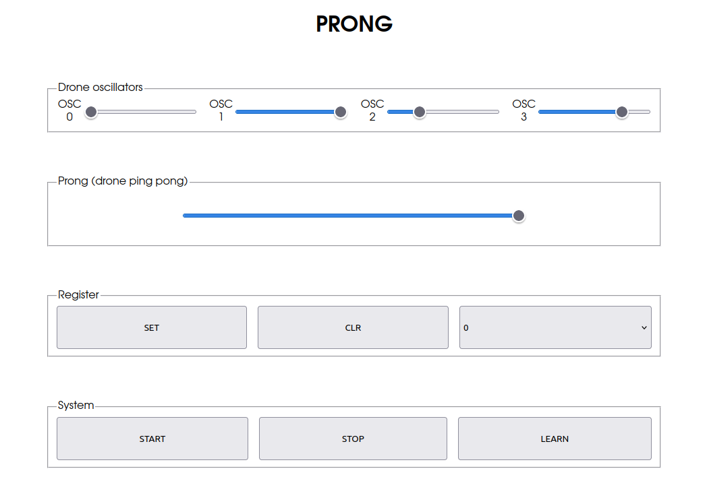

Ping-pong drone - MIDI MPE controller.
======================================

This project is built as an experiment into MPE (MIDI Polyphonic Expression). It is being prototyped as a browser-based controller before being built as a standalone hardware controller.

## 4 oscillator drone interpolator

Scope of the project:

1. Set four oscillators to sound "nice". Make a chord or something.
2. Store the current state into a register by pressing the SET button.
3. Set the oscillators again to a different chord.
4. Store the new state into the next register by pressing SET again.
5. Repeat until you have the chord progression you want.
6. Use the main knob to transition between register 1 and 2.
7. When the main knob reaches 100%, moving it back to 0% will transition between 2 and 3.
8. This "ping pong" transition will loop around to the first register when the last one is reached.

## Web prototype

To quickly prototype this working, a browser-based controller is made. No frills, just black and white, dirty code.

## Hardware build

There will be only one button on the physical product, which will have three functions:

- Press once: SET
- Hold for 1 second: Reset to register 0
- Hold for 5 seconds: CLEAR

Instead of using the START/STOP/LEARN buttons, each oscillator will have its own on-off switch. This also helps when tuning an oscillator, allowing the others to be temporarily muted.

// TODO: Hardware is currently WIP
